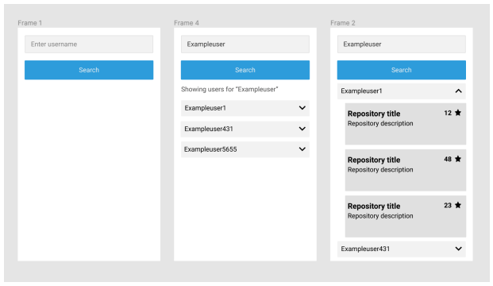

# GitHub Repositories Explorer

[](https://reactjs.org/)
[](https://www.typescriptlang.org/)
[](https://vitejs.dev/)
[](https://tailwindcss.com/)
[](https://opensource.org/licenses/MIT)

A modern, responsive React + TypeScript application for exploring GitHub users and their repositories. This application integrates with the GitHub REST API v3 to provide an intuitive interface for searching users and viewing their public repositories with detailed information.

## 📋 Table of Contents

- [🚀 Live Demo](#-live-demo)
- [🎨 Design](#-design)
- [🌟 Features](#-features)
- [🛠️ Technology Stack](#️-technology-stack)
- [🏛️ Architecture & Design Patterns](#️-architecture--design-patterns)
- [📋 Prerequisites](#-prerequisites)
- [🚀 Quick Start](#-quick-start)
- [📝 Available Scripts](#-available-scripts)
- [🎯 Usage Guide](#-usage-guide)
- [🌐 API Integration](#-api-integration)
- [🏗️ Project Structure](#️-project-structure)
- [🧪 Testing](#-testing)
- [🚀 Deployment](#-deployment)
- [🐛 Troubleshooting](#-troubleshooting)

## 🚀 Live Demo

**[Try the live application here!](https://andrepangestu.github.io/github-repositories-explorer)**

The demo is automatically deployed from the main branch and showcases all the features described in this README.

## 🎨 Design

### Application Wireframe Design

The application follows a clean, user-friendly design based on the following wireframe:



**Design Flow:**

1. **Frame 1**: Initial search interface with clean input field and search button
2. **Frame 4**: Search results showing list of users matching the query
3. **Frame 2**: Expanded user view displaying repositories with details (stars, descriptions)

## 🌟 Features

### 🔍 **User Search**

- Manual search with up to 5 user results
- Real-time search with loading indicators
- Error handling for failed searches
- Rate limit management

### 📊 **Repository Explorer**

- Expandable user dropdowns
- Complete repository listings (no pagination limits)
- Repository details including:
  - Star counts with visual indicators
  - Programming language with color coding
  - Last updated timestamps
  - Repository descriptions
  - Direct links to GitHub

### 🎨 **User Experience**

- Responsive design for all screen sizes
- Smooth animations and transitions
- Loading states and error messages
- Clean, modern interface design
- Keyboard navigation support

## 🛠️ Technology Stack

### **Frontend**

- **React 19.1.0** - Latest React with concurrent features
- **TypeScript 5.8.3** - Type-safe JavaScript with latest features
- **Tailwind CSS 3.4.17** - Utility-first CSS framework
- **Lucide React 0.525.0** - Beautiful, customizable SVG icons

### **Build Tools & Development**

- **Vite 7.0.0** - Next-generation frontend build tool with fast HMR
- **PostCSS 8.5.6** - CSS post-processing with plugins
- **Autoprefixer 10.4.21** - Automatic CSS vendor prefixes
- **ESLint 9.29.0** - JavaScript/TypeScript linting with latest rules
- **TypeScript ESLint 8.34.1** - TypeScript-specific linting rules

### **HTTP Client**

- **Axios 1.10.0** - Promise-based HTTP client for API requests

### **State Management**

- **React Context API** - Built-in React state management solution
- **useReducer Hook** - Complex state logic management with predictable updates
- **Custom Hooks** - Abstracted state logic for clean component separation
- **In-Memory Caching** - Map-based caching for users and repositories data
- **Request Debouncing** - Performance optimization for search queries
- **Abort Controllers** - Request cancellation for better UX

### **Testing Framework**

- **Vitest 3.2.4** - Fast unit test framework powered by Vite
- **Testing Library (React) 16.3.0** - Simple and complete testing utilities
- **Testing Library (User Event) 14.6.1** - User interaction simulation
- **Testing Library (Jest DOM) 6.6.3** - Custom Jest matchers for DOM
- **jsdom 26.1.0** - Pure JavaScript DOM implementation for testing

### **Development Tools**

- **@types/node 24.0.7** - Node.js type definitions
- **@types/react 19.1.8** - React type definitions
- **@types/react-dom 19.1.6** - React DOM type definitions
- **gh-pages 6.3.0** - Deployment to GitHub Pages
- **@tailwindcss/forms 0.5.10** - Enhanced form styling with Tailwind CSS
- **globals 16.2.0** - Global type definitions for ESLint configuration

### **Configuration & Tooling**

- **TypeScript Configuration** - Strict mode with separate configs for app and Node.js
- **Vite Configuration** - Custom setup with React plugin and testing environment
- **Tailwind Configuration** - Extended theme with custom GitHub color palette
- **ESLint Configuration** - Modern flat config with React and TypeScript rules
- **PostCSS Configuration** - Tailwind CSS and Autoprefixer integration
- **Test Configuration** - Vitest with jsdom environment and custom setup
- **GitHub Actions** - Automated deployment workflow with proper permissions

## 📋 Prerequisites

Before running this project, ensure you have:

- **Node.js** (version 18.0.0 or higher) - [Download](https://nodejs.org/)
- **npm** (version 8.0.0 or higher) or **yarn** (version 1.22.0 or higher)
- **Git** for version control - [Download](https://git-scm.com/)
- A modern web browser (Chrome, Firefox, Safari, Edge)

## 🚀 Quick Start

### 1. Clone the Repository

```bash
git clone https://github.com/andrepangestu/github-repositories-explorer.git
cd github-repositories-explorer
```

### 2. Install Dependencies

```bash
npm install
```

### 3. Start Development Server

```bash
npm run dev
```

### 4. Open in Browser

Navigate to `http://localhost:3000` in your browser.

> **Note**: This project is configured to use port 3000

## 📝 Available Scripts

| Script                  | Description                              |
| ----------------------- | ---------------------------------------- |
| `npm run dev`           | Start development server with hot reload |
| `npm run build`         | Build for production                     |
| `npm run preview`       | Preview production build locally         |
| `npm run lint`          | Run ESLint for code quality checks       |
| `npm test`              | Run unit tests with Vitest               |
| `npm run test:ui`       | Run tests with interactive UI            |
| `npm run test:coverage` | Generate test coverage report            |

## 🎯 Usage Guide

### Basic Search Flow

1. **Enter Username**: Type a GitHub username in the search field
2. **Click Search**: Press the blue "Search" button to initiate search
3. **View Results**: See up to 5 matching users in dropdown format
4. **Expand User**: Click on any user to expand and view their repositories
5. **Explore Repositories**: Browse ALL repositories with detailed information
6. **Visit GitHub**: Click repository titles to view them on GitHub

### Keyboard Navigation

- **Tab**: Navigate between interactive elements
- **Enter**: Activate buttons and expand/collapse users
- **Escape**: Close expanded dropdowns
- **Arrow Keys**: Navigate within dropdown lists

### Search Tips

- Use exact usernames for best results
- Partial matches will show similar usernames
- Search is case-insensitive
- Special characters are supported

## 🌐 API Integration

### GitHub REST API v3

This application integrates with two main GitHub API endpoints:

#### User Search

```
GET https://api.github.com/search/users?q={username}&per_page=5
```

- Returns up to 5 users matching the search query
- Sorted by follower count (descending)

#### User Repositories

```
GET https://api.github.com/users/{username}/repos?sort=updated&direction=desc
```

- Returns ALL public repositories for a user
- Automatically handles pagination for users with 100+ repositories
- Sorted by last updated date

## 🏗️ Project Structure

```
github-repositories-explorer/
├── .github/                   # GitHub configuration
│   └── workflows/            # GitHub Actions workflows
│       └── deploy.yml        # Automated deployment to GitHub Pages
├── public/                   # Static assets
│   └── github.svg             # Github logo favicon
├── src/                     # Source code
│   ├── components/          # React components
│   │   ├── RepositoryList.tsx # Repository display component
│   │   ├── SearchBar.tsx     # Search input component
│   │   ├── UserDropdown.tsx  # User dropdown component
│   │   └── UserList.tsx      # User list component
│   ├── contexts/            # React contexts
│   │   └── GithubApiContext.tsx # GitHub API context provider
│   ├── hooks/               # Custom React hooks
│   │   └── useGithubApi.ts  # GitHub API custom hook
│   ├── services/            # API services
│   │   └── githubApi.ts     # GitHub API integration layer
│   ├── types/               # TypeScript definitions
│   │   └── github.ts        # GitHub API type definitions
│   ├── test/                # Test files organized by feature
│   │   ├── components/      # Component tests
│   │   │   ├── RepositoryList.test.tsx
│   │   │   ├── SearchBar.test.tsx
│   │   │   ├── UserDropdown.test.tsx
│   │   │   └── UserList.test.tsx
│   │   ├── contexts/        # Context tests
│   │   │   └── GithubApiContext.test.tsx
│   │   ├── hooks/           # Hook tests
│   │   │   └── useGithubApi.test.tsx
│   │   ├── integration/     # Integration tests
│   │   │   └── App.test.tsx
│   │   ├── services/        # Service tests
│   │   │   └── githubApi.test.ts
│   │   ├── custom-render.tsx # Custom render utilities
│   │   ├── setup.ts         # Test setup configuration
│   │   ├── test-providers.tsx # Test context providers
│   │   └── test-utils.tsx   # Test utility functions
│   ├── App.tsx              # Main application component
│   ├── main.tsx             # Application entry point
│   ├── index.css            # Global styles with Tailwind
│   └── vite-env.d.ts        # Vite type definitions
├── coverage/                # Test coverage reports (generated)
├── docs/                    # Documentation and assets
│   └── images/              # Documentation images
│       └── design-mock-up.png # Application design mockup
├── dist/                    # Production build output (generated)
├── node_modules/            # Dependencies (generated)
├── .gitignore               # Git ignore configuration
├── .vscode/                 # VS Code workspace settings
├── eslint.config.js         # ESLint configuration (flat config)
├── index.html               # HTML template entry point
├── package.json             # Project metadata and dependencies
├── package-lock.json        # Dependency lock file
├── postcss.config.js        # PostCSS configuration
├── README.md                # Project documentation (this file)
├── tailwind.config.js       # Tailwind CSS configuration
├── tsconfig.json            # Main TypeScript configuration
├── tsconfig.app.json        # TypeScript app-specific configuration
├── tsconfig.node.json       # TypeScript Node.js configuration
└── vite.config.ts           # Vite configuration with testing setup
```

## 🧪 Testing

### Test Coverage

The project includes comprehensive test coverage:

- **Component Tests**: React component rendering and behavior
- **Integration Tests**: User interaction flows
- **API Tests**: Service layer functionality
- **Utility Tests**: Helper function validation

### Running Tests

```bash
# Run all tests in watch mode
npm test

# Run tests once with coverage report
npm run test:coverage

# Run tests once without watch mode
npm run test:run

# Run tests with verbose output for CI
npm run test:ci
```

### Test Examples

```typescript
// Component test example
test("renders search input and button", () => {
  render(<UserSearch onUserSelect={mockHandler} isLoading={false} />);

  expect(screen.getByPlaceholderText("Enter username")).toBeInTheDocument();
  expect(screen.getByRole("button", { name: /search/i })).toBeInTheDocument();
});

// Integration test example
test("searches for users and displays results", async () => {
  const user = userEvent.setup();
  render(<UserSearch onUserSelect={mockHandler} isLoading={false} />);

  await user.type(screen.getByPlaceholderText("Enter username"), "octocat");
  await user.click(screen.getByRole("button", { name: /search/i }));

  await waitFor(() => {
    expect(
      screen.getByText(/showing users for "octocat"/i)
    ).toBeInTheDocument();
  });
});
```

## 🚀 Deployment

### Build for Production

```bash
npm run build
```

This creates an optimized build in the `dist/` directory.

### Deployment Options

#### GitHub Pages (Current Setup)

This project is configured for deployment to GitHub Pages:

**Automatic Deployment:**

1. Push code to the `main` branch
2. Run `npm run deploy` to build and deploy to GitHub Pages
3. The site will be available at: [https://andrepangestu.github.io/github-repositories-explorer](https://andrepangestu.github.io/github-repositories-explorer)

## 🐛 Troubleshooting

### Common Issues

#### Port Already in Use

```bash
# Kill process on port 3000
npx kill-port 3000

# Or use different port
npm run dev -- --port 5173
```

#### Dependencies Issues

```bash
# Clear node_modules and reinstall
rm -rf node_modules package-lock.json
npm install

# Or if using Windows
rmdir /s node_modules
del package-lock.json
npm install
```

#### Build Issues

```bash
# Clear Vite cache
npx vite --force

# Clear npm cache
npm cache clean --force
```

### Error Messages

| Error                 | Cause                  | Solution                 |
| --------------------- | ---------------------- | ------------------------ |
| "Rate limit exceeded" | Too many API requests  | Wait or add GitHub token |
| "User not found"      | Invalid username       | Check username spelling  |
| "Network error"       | No internet connection | Check connection         |
| "Build failed"        | TypeScript errors      | Fix type errors          |

**Made with ❤️ by [Andre Pangestu](https://github.com/andrepangestu)**

**⭐ Star this repository if you find it helpful!**
